<a href="https://megannyhan.github.io/C1_PP2_HarryPotterQuiz/" alt="The Ulitmate Harry Potter Quiz Website" target="_blank" rel="noopener">Live Website</a>

 # PROJECT 1: THE ULTIMATE HARRY POTTER QUIZ

The Ultimate Harry potter Quiz, is a quiz that main purpose is to test members of the Harry Potter fandom's knowledge of the vast Harry Potter universe. The main purpose of this site is to offer the fandom of any age and technical background a chance to experience a fully interactive quiz, that offers the user feedback of how they are doing in the quiz/ how far through the quiz they are. *The quiz also utilizes email JS to send the users an automated email with the users result from the quiz*.

## Table of Content

1. [Project Goals](#project-goals)
    1. [User Goals](#user-goals)
    2. [Site Owner's Goals](#site-owners-goals)
2. [User Experience](#user-experience)
    1. [Target Audience](#target-audience)
    2. [User Requirements](#user-requirements)
    3. [User Stories](#user-stories)
3. [Design](#design)
    1. [Colour](#colour)
    2. [Fonts](#fonts)
    3. [Structure](#structure)
    4. [Wireframes](#wireframes)
4. [Technology](#technology)
    1. [Develpoment Languages Used](#develpoment-languages-used)
    2. [Frameworks and Tools used](#frameworks-and-tools-used)
5. [Features](#features)
6. [Testing](#testing)
    1. [HTML Validation](#HTML-validation)
    2. [CSS Validation](#CSS-validation)
    3. [JS Validation](#js-validation)
    4. [Accessibility Test](#accessibility-test)
    5. [Performance](#performance)
    6. [Device testing](#device-testing)
    7. [Browser Compatibility](#browser-compatibility)
    8. [Testing user stories](#testing-user-stories)
9. [Bugs](#Bugs)
10. [Deployment](#deployment)
11. [Credits](#credits)
12. [Acknowledgements](#acknowledgements)

## Project Goals 
### User Goals

<ul>
    <li>Allowing memebers of the Harry Potter fandom to quiz their knowledge of the Harry Potter universe.
    </li>
    <li>Be able to track how far in the quiz the users is, <strong>how many questions are answered and have yet to be answered</strong> which will aid the result they get at the end.</li>
    <li>Be able to enter their email <strong>to recieve their results</strong> directly into their mailboxes.</li>
</ul>

### Site Owner's Goals
<ul>
    <li> Increase traffic to the website.</li>
    <li>Allow the user to get feedback on each question that is answered, which will hopefully increase the users user experience of the site.</li>
    <li> Have a simply designed website that is accessibile to all users with any tech experience.</li>
    <li> Offer a direct point of contact to new or current users from the website.</li>
    </ul>

### User Experience:

### Target Audience 

 The target audience for this site is quite broad. The fandom itself covers a wide range of ages, cultures and ethnicity. The english is easy and should be understandable to people regardless of theit levels of english. The simple design aids users of begginers knowledge of computers and is straight-forward to navigate through. 

### User Requirements

As I have mentioned, we have a very large/ varied target audience, and because of this the site has to be simple in design and very accessible. They way I have tackled this are as follows:

<ul>
    <li>Simple navigation that is non-ambiguous</li>
    <li>Have skimmable text for answers and questions which are easy to understand.</li>
    <li>Simple presentation of content on the page that make logical sense. </li>
    <li>A functional responsive wesite that allow the user to do the quiz, regardless of screen size. </li>
    <li>A straightforward and professional form that allows users to easily contact the business, and recieve their feedback.</li>
</ul>

### User Stories

### First time and Recurring Stories
<ol>
    <li>As a user, I want to a quiz that is responsive to all screen types.</li>
    <li>As a user, I want to be able to test my knowledge of the harry potter universe and know how I scored at the end of the quiz.</li>
    <li>As a user I want to know exactly what my score was in the quiz without confusion.</li>
    <li>As a user who not tech savy, I want the quiz to be easy to navigate through and still be able to have as good of an experience as someone who knows how to navigate online better than me.</li>
        <li>As a user who doesn't understand websites, I want to easily know what answer I got wrong and right, and how many questions I still have to answer
    </li>
    <li>As a user who is new to the Harry Potter universe, I want to know what the correct answer is before even when I have answered the questions wrong.</li>
</ol>

### Site's Owner Stories
<ol>
    <li>As the owner of the site, I want my potential customers to have a place where they can enjoy playing a challenging quiz to entertain online users. </li>
    <li>As the owner, I want the website to be fully interactive and responsive to any screen sizes our users have.</li>
    <li>As the owner, I want a website that is accessible to anyone.</li>
    <li>As the owner, I want a site that will follow the branding that has been established by nteh franchise.</li>
    <li> As the owner, I want a site that will have the potential to be built upon in the future.</li>
    <li> As the owner, I want the customers to easily recieve feedback through email and on the screen infront of them.</li>
</ol>

## Design:

### Design Choices

 The Harry Potter multiverse (both books and mives) itself is a multiverse with a wide target audience, and with this in mind I wanted to create a site that was accessible to everyone regardless of their technical ability, level of english, and ability to operate a computer. I wanted all designs to be simplistic, the navigation to be logical and seamless and for the accessibility to be a primary concern. 

### Colour

  
The color scheme that I have used throughout the website is taken directly from the brand guidelines that were available online. I used the following site to get the color scheme: https://www.qualitylogoproducts.com/blog/harry-potter-color-schemes/ . The colors here are used throughout the site on eachpage and interaction. 

Colours: Gryffindor

  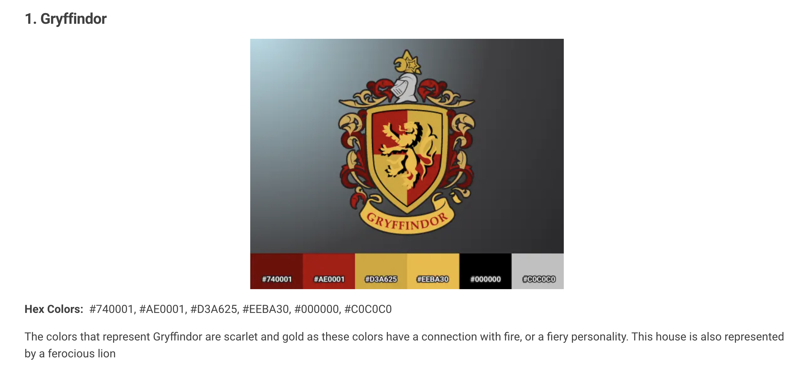

  

Colours: Slytherin

  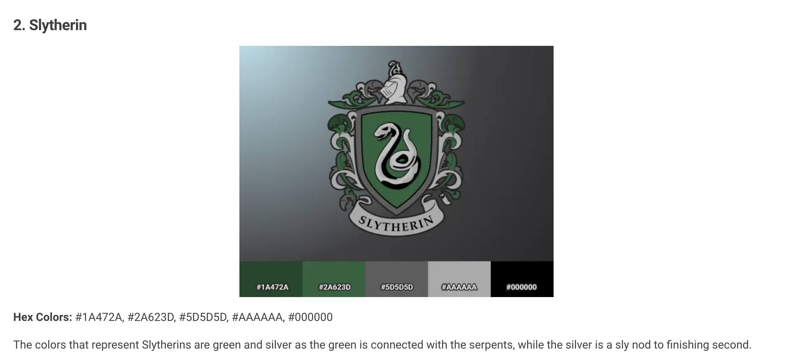

   

Colours: Ravenclaw

  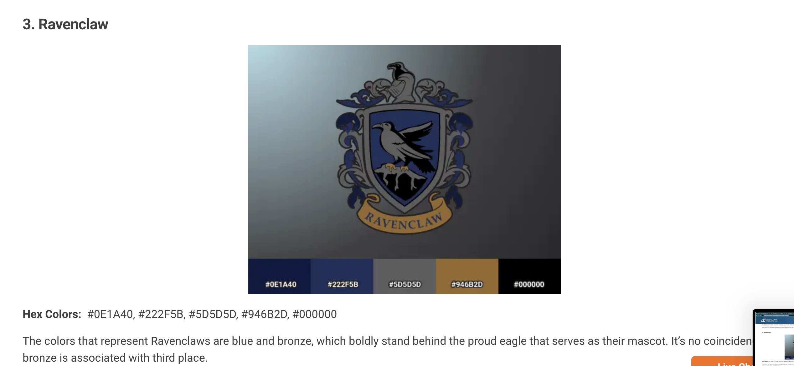

  

Colours: Hufflepuff

  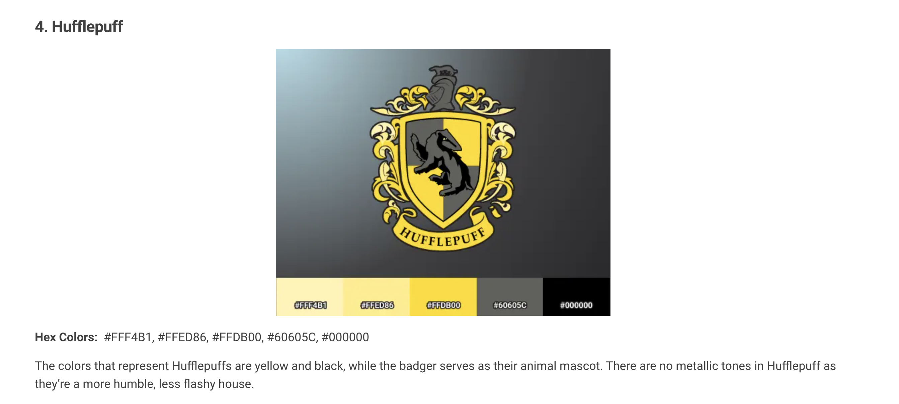

 ### Fonts
  
Fonts used on the website were Arial and Benne - A sans serif with a Harry Potter vibe. Benne was used for headings and arial was used in pteh answers.

 ### Structure

The strucutre of this website was designed to be easily navagated through and easy to learn. I made sure that each page followed a similar structure but didn't comprimise the content that each page held. The following pages are within the structure of the site:

<ul>
<li> A home Page = Basic information about the site, with an image of the building and a meet the team section.</li>
<li> A Services page = The services page offers an overview of the services offered by the resource center. </li>
<li> A gallery page = Offers the user a chance to see possible familiar faces taking part in local activites/ meetings.    This page aims to encourage the user to want to partake in the activites/ events themselves.</li>
<li> A Contact Page = Gives the user contact information and a google maps view of where the building is. There is also a contact form for a user to use to contact the comapny.</li>

### Wireframes

The wireframes included have evolved and changed since I originally drew them up over a week ago. This is due to the limitations of my skills thus far, and developed and changes I have made personally to the look of the site when building it.

 Home Page

 Results Page 

Contact Page

## Technology:

### Develpoment Languages Used

<ul>
<li> HTML5 </li>
<li> CSS </li>
<li> JavaScript</li>
<li> EmailJS </li>
</ul>

###  Frameworks and Tools used
<ul>
<!-- <li> Bootstrap  </li> -->
<li> Git, GitHUb, and GitPod </li>
<li> Balsamiq </li>
<li> Google Fonts </li>
<li> Font Awesome </li>
<li> Google Developer Tools (for responsive site)</li>
<li> EmailJS </li>
</ul>

## Features:

This site has two pages- four sections with a total of nine features.

### Home Page

#### Navigation Section

<ul>
    <li>The navigation bar is very limited to what I can do, where you can go and what options there are to choose from. The nav bar is basically a start quiz button. There is also a "email your results" option where you can send yourself your results to your email. </li>
    <li> The navigation will also be responsive across all devices, which will also serve to the accessibilty of the site do a myriad of users.</li>
    <li> Navigation throught the quiz features a next question button. The user is not able to exit the quiz before they finish it. This is made clear to the users at the information/rules section that they have to read before entering the quiz. Here there is a continue with quiz or exit quiz option.</li>
    <LI> When the quiz is over the user is given the option of replaying the quiz or quiting it. Quiting it takes the user back to the start quiz screen, and replay takes the user to the first question of the quiz.</LI>
    </ul>
 
 User Stories covered : 1, 4

 
 Site Owner's Stories covered: 2, 3, 5,6 

        

Navigation

        

        

        

        

        

        

        

        

        

        

        

#### Information/ Rules section
<ul>
    <li>The Information/rules section offers the user 4 brief set of rules to help quide them through the quiz.</li>
    <li> These rules include:   1. You will have only 20 seconds to answer each question.
                                2. Once you select your answer you will have to move onto the next question.
                                3. You will be unable to select another answer once the time runs out.
                                4. Your overall score is dictated by the amount of correct answers you have scored..</li>
    </ul>
    
 User Stories covered : 4

    
Site Owner's Stories covered: 2

        

Welcome Section

        

#### Meet the Team Section
<ul>
     <li>
     Also featured on the main page is a meet the team section which shows the user who they can expect to see when they visit the office.</li>
     <li> The meet the team section also goes into detail of what each person work as and what they can help you with.
     </li>
     <li> The main purpose of this section is to offer a freinsly introduction to the people you can expect to see in the office if you decide to go in.</li></ul>
     
 User Stories covered : 4, 6

     
Site Owner's Stories covered: 5, 5 

        

Meet the Team

        

#### Footer
<ul>
     <li> The footer allows the user to contact and view the social media pages that the organisation have.</li>
     <li> The social media links comprise of the respective social network icons for easy accessibility.</li>
     <li> The reason the design is so simple is that I didn't want it to be too cluttered with information. I felt less is more.</li></ul>
     
 User Stories covered : 4, 6,

     
 Site Owner's Stories covered: 2, 3

        

Footer

        

### Services Page
#### Services Grid and Contact us for more Button
<ul>
    <li> The services page is very plane. It features a grid style list of services that the resource center provides with a button to redirect the user to the contact page in a new tab.</li>
    <li> The purpose of adding the contact button is so that users will be redired to the contact page to encourage them to contact the company about the services they are interested in. This covers a site owner story too.</li>
    </ul>
    
 User Stories covered : 1, 2, 4, 6

    
Site Owner's Stories covered: 1, 2, 3, 4
 
        

Services grid and Contact Button

        

### Gallery Page

#### Gallery grid
<ul>
    <li>The gallery page features a grid of photos taken of the local community.</li>
    <li> The main purpose of the gallery is to encourage users to get active in the community and be aware of the events that are taking place.</li></ul>
    
 User Stories covered : 3, 4

    
Site Owner's Stories covered: 2, 4

        

Gallery Grid

        

### Contact Page

#### Google Maps Feature and Contact Form
<ul>
    <li>The contact page offers the user a chance to view the location of the office in the Milford Area on Google Maps. </li>
    <li> The contact form offers the users to message the office to ask about a certain service, or inquire about general queries easily and directly.</li>
    <li> Another purpose of th contact page and it's elements is to encourage the user to contact the office to inquire about the services offered.</li></ul>
    
 User Stories covered :2, 3, 5, 6

    
Site Owner's Stories covered: 2, 4, 6
 
        

Contact: Google Maps and form

        

 ## Testing:

 ### HTML Validation

 To Validate my HTML I used the W3C Markup Validation Service. All HTML passed its Validation with no errors but a few warnings as shown below in the pictures.

index.html

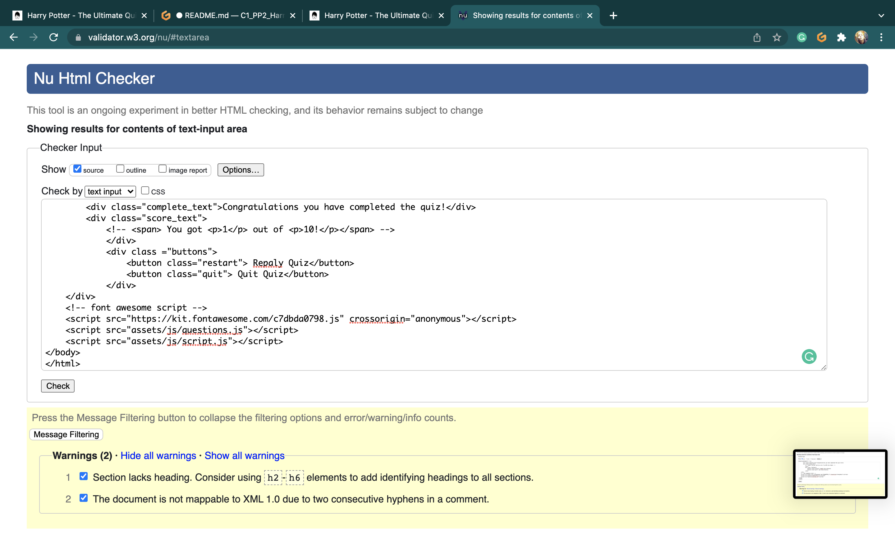

email.html

 ### CSS Validation

 To Validate my CSS, I used the W3C Jigsaw CSS Validation Service. All CSS passed its Validation.

CSS

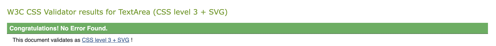

### JS Validation

 To Validate my Java Script, I used the JSHint JS Validation Service. All Java Script passed its Validation with just a few warnings.

email.js

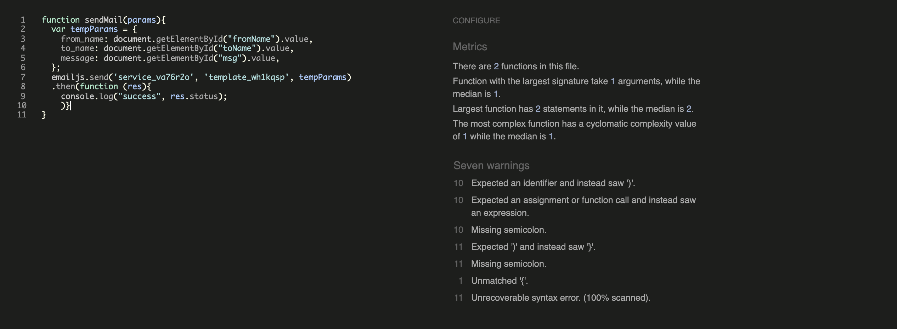

script.js

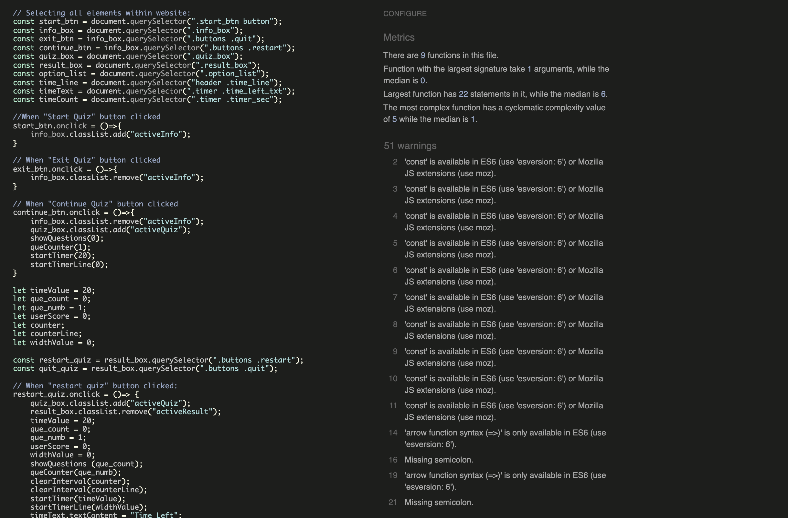

questions.js

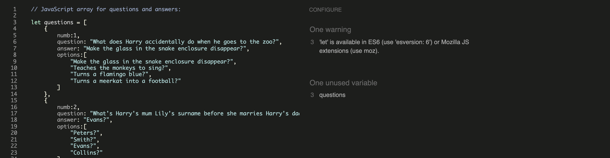

### Accessibility Test

 To Validate my accessibility, I used the WAVE WebAIM web accessibility evaluation tool. I passed with no errors. My site was awarded the following: https://wave.webaim.org/report#/https://megannyhan.github.io/C1_PP2_HarryPotterQuiz/ 

Quiz

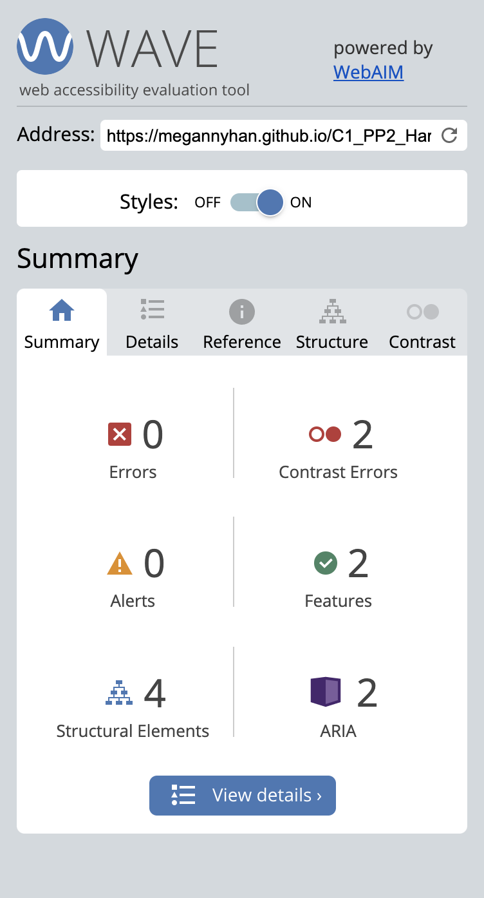

## Performance

 To determine my sites performance, I used the Ligthouse web accessibility develepment tool. My site was awarded the following: 

Website Test

Mobile Test
 
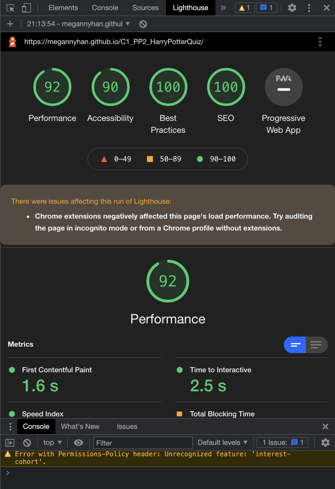

## Device Testing

The site was tested on the following decives using the responsive tool in Google Chromes Developer tools:

<ol>
<li>MacBook Pro</li>
<li>iPhone xr/11/12</li>
<li>iPad (Regular size)</li>
</ol>

## Browser Compatibility

 The site was also tested on the following browsers

<ol>
<li>Google Chrome</li>
<li>Safari</li>
<li>Firefox</li>
</ol>

### Testing User Stories

    1."As a user, I want to be able to view the services that I can avail of in my local community."
| **Feature** | **Action** | **Expected Result** | **Actual Result** |
|-------------|------------|---------------------|-------------------|
| Services information grid| Navigate to the Services page, locate the services grid | Finds a service they are interested in and goes to the contact page using contact button |    Works as expected |
| Nav- Locate services and then contact button | On any page scroll up to the nav bar | Find the list of services | Works as expected |

User Testing 1

    2."As a user, I want to know where I can get a avail of printing in my area."
| **Feature** | **Action** | **Expected Result** | **Actual Result** |
|-------------|------------|---------------------|-------------------|
| Services information grid| Navigate to the Services page, locate the services grid and read prinitng info box | Finds the printing box and goes to the contact page using contact button |   Works as expected |
| Nav- Locate services page, services list and then contact button | On any page scroll up to the nav bar | Find the list of services | Works as expected |

User Testing 2

    3."As a user with the view of visting the office, I want to know exactly where it is located."
| **Feature** | **Action** | **Expected Result** | **Actual Result** |
|-------------|------------|---------------------|-------------------|
| Contact Information and Google Maps| Navigate to the Contact page, locate the contact information and google maps box | Finds the location and travels to the office |   Works as expected |
|Google Maps in contact page and other contact information | On any page scroll up to the nav bar | Find the comapnies contact inforamtion and google maps box | Works as expected |

User Testing 3

    4."As a user who not tech savy, I want to be able to read, understand and navigate an easy and understandable website."
| **Feature** | **Action** | **Expected Result** | **Actual Result** |
|-------------|------------|---------------------|-------------------|
|Navigation| Navigate to any pages in the site, and perform desired goal | Finds the information they wanted | Works as expected |
|Nav bar on top of each page | On any page scroll up to the nav bar | Find any information available to the user | Works as expected |

User Testing 4

 The nav bar is simple in design and offers 4 options

    5."As a user who doesn't understand websites, I want to easily find a phone number for the office so I can contact them."
| **Feature** | **Action** | **Expected Result** | **Actual Result** |
|-------------|------------|---------------------|-------------------|
| Contact Information | Navigate to the Contact page, locate the contact information and phone number or contact form | Finds the phone number and calls the office or uses the contact form to conact the office via email| Works as expected |
|Contact Information and contact form in contact page| On any page scroll up to the nav bar | Finds the companies contact inforamtion | Works as expected |

User Testing 5

    6."As a user who owns a local business, I want to contact them get a quote for the price of business cards."
| **Feature** | **Action** | **Expected Result** | **Actual Result** |
|-------------|------------|---------------------|-------------------|
|Services Page, and Graphic Design box with contact button | Navigate to the Services page, locate the services information and the contact us button | Finds the phone number when redirected to the phone number and calls the office or uses the contact form to ask for a qoute |
|Services information grid, Contact Information and contact form in contact page| On any page scroll up to the nav bar | Finds the companies services information and contact inforamtion to ask for a qoute easily | Works as expected |

User Testing 6

### Testing Site Owner's Stories

    1."As the owner of the site, I want my potential customers to have a place where they can view the services I offer."
| **Feature** | **Action** | **Expected Result** | **Actual Result** |
|-------------|------------|---------------------|-------------------|
| Services information grid| Navigate to the Services page, locate the services grid | Finds a service they are interested in and goes to the contact page using contact button | Works as expected |
| Nav- Locate services and then contact button | On any page scroll up to the nav bar | Find the list of services | Works as expected |

User Testing 7

    2."As the owner, I want to have an online platform that can be a hub of information for the locals in the area."
| **Feature** | **Action** | **Expected Result** | **Actual Result** |
|-------------|------------|---------------------|-------------------|
| Home Page | Allows the owner to easily up date and change the information displayed on the site.| Works as expected |
| Home page is the landing page which users will land on firat | Update the website as needed | New information displayed | Works as expected |

User Testing 8

    3."As the owner, I want a website that is accessible to anyone."
| **Feature** | **Action** | **Expected Result** | **Actual Result** |
|-------------|------------|---------------------|-------------------|
| Simple style Navigation | Navigation allows users a restricted choice between possible pages they need information from (Restricted as it doesn't allow too many decisions) | Finds the information they need easily |   Works as expected |
|Nav bar at the top of page allows simple navigation throughput site, providing a good User Experience | On any page scroll up to the nav bar | Find the information they wanted seamlessly | Works as expected |

User Testing 9

 The Navigation bar is simple and easily used by anyone.

    4."As the owner, I want a site that will encourage my customers to use the services we have to offer."
| **Feature** | **Action** | **Expected Result** | **Actual Result** |
|-------------|------------|---------------------|-------------------|
|Navigation, Services Page, and Services Grid| Navigate to the services page where you can view the services grid| Finds the information on the services they wanted | Works as expected |
|Nav bar on top of each page including a link to the services page | On any page scroll up to the nav bar and select the services tab | Find any information on services available to the user and offer the possibilitiy of contacting the centre for more information they need | Works as expected |

User Testing 10

    5."As the owner, I want a site that will have the potential to be built upon in the future."
| **Feature** | **Action** | **Expected Result** | **Actual Result** |
|-------------|------------|---------------------|-------------------|
| Nav bar with the option of expanding to hold more pages| Navigation bar is wide and I as a developer intend to add a blog section in the future among other pages | To have more options added to the nav bar without comprimising the readability| Works in progress |

User Testing 11

 The Navigation bar is simple and can easily be extended on any device..

    6."As the owner, I want the customers to easily locate the company."
| **Feature** | **Action** | **Expected Result** | **Actual Result** |
|-------------|------------|---------------------|-------------------|
|Contat Page with a adress and google maps link | Navigate (using the nav bar) to the Contact Page and find at the top of the page an adress, and when scrolled down the user will find a map too | Find the location easily and travels to the office | Works as Expected|
|Contact page with address and map, also a phone number for back up incase someone doesn't understand the map| On any page scroll up to the nav bar and find the contact page | Finds the companies address and other location informtion | Works as expected |

User Testing 12

## Bugs:

| **Bug** | **Fix** |
| ----------- | ----------- |
| Website Fonts don't work in Firefox and safari| Choose back-up font for other browsers |
| Website moves to the left on larger monitors | Add another media quiery for larger than laptop screens |
| The map moves to the left on mobile repository | change the width of the map in the html to fit desktop and tablet then mobile again and push footer down|

## Deployment:

In order to deploy my site I took the following steps using GitHub pages:

<ol>
<li>In the GitHub repository, select the "Settings" tab at the top of the page.</li>
<li> Then on the left hand-side in the menu, select "Pages".</li>
<li> The where it says source, used the dropdown menu to select "Main".</li>
<li> After a few moments, refresh the website and you should have a pop-up come up to tell you that "Your site has been published" with your link coming after.</li>
</ol>

 My link is: https://megannyhan.github.io/CI_PP1_MDRC/ 

 Forking the repository is done by the following steps:

<ol>
<li>Within the GitHub repository, click "Fork" (a button) at the upper right hand corner.</li></ol>

 Cloning the repository is done by the following steps:

<ol>
<li>Within the GitHub repository, locate "Code" (a button) found at the top of the page.</li>
<li> Once selected, select which you prefere out of the following choise: HTTPS, SSH or GitHub CLI and press the copy URL to your clipboard.</li>
<li> Then open Git Bash.</li>
<li> Change the current directory to your desired location for the cloned directory.</li>
<li>Finally, type "git clone" and paste your URL.</li>
<li>Once you press enter your local clone is created.</li></ol>

## Credits:

 Images not li nked and referenced below were designed and taken by the author.

### Site Images:
<ul>

<li>https://www.pexels.com/photo/woman-smiling-and-holding-teal-book-1181424/ Photo by Christina Morillo from Pexels</li>

<li> https://pbs.twimg.com/profile_banners/1442473373020213248/1632836293/1500x500 Designed by Declan Meehan featured on Twitter</li>

<li> Google Maps Link: https://www.google.com/maps/place/Milford+%26+District+Resource+Centre/@55.0895701,-7.6994824,15z/data=!4m2!3m1!1s0x0:0x1295c52d66ece440?sa=X&ved=2ahUKEwjz_M3qvPzzAhWSSsAKHQfTAC0Q_BJ6BAhcEAU Designed by Google maps</li>

<li>https://www.pexels.com/photo/gray-and-black-laptop-computer-2764666/ Photo by Oleg Magni from Pexels </li>

<li>https://thisismilford.com/wp-content/uploads/2020/02/mdrc10166-1024x768.jpg photo by Declan Meehan on MDRC.ie</li>
</ul>

### Gallery Images:

<ul>
<li>https://wallpapersafari.com/w/85olXW Photo by Wallpapper Safari </li>
</ul>
### Source Code Used in Site

 Due to limitations in my knowledge I googled certain code that I wanted to use for the site, see code listed below:

<ul>
<li> Code to help with the contact form was taken from bootstrap: https://getbootstrap.com/docs/5.1/forms/form-control/ 
</li>
<li> I also used a youtube video to help further my understanding of JavaScript and aid me in the making of my quiz: https://www.youtube.com/watch?v=WUBhpSRS_fk&t=1732s . It was not copied and pasted directly but it was used for help so I thought I would mention it. </li>
</ul>

## Acknowledgements:

 I would like to take this oppurtuinity to thank and acknowlege the following people:
<ul>
<li> I would like to thank Mo Shami - my mentor - for his feedback and guidence whilst creating the project.</li>
<li> I would like to thank those on the code institute slack channel for help with any issues I had.</li>
<li> I also want to say that I did intend on making a error 404 page but ran out of time.</li>
</ul>

