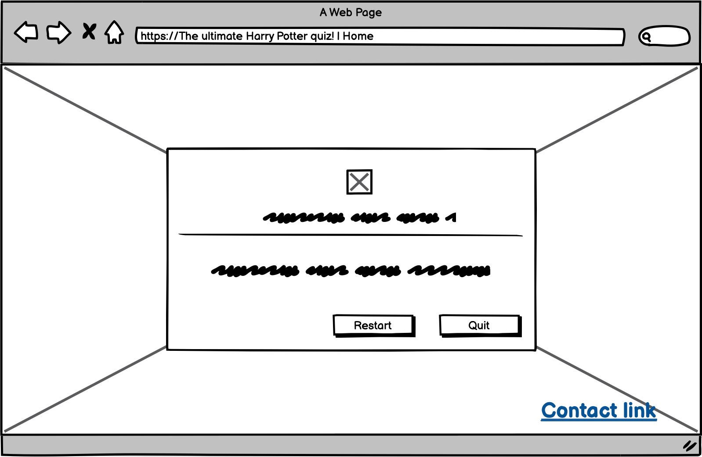
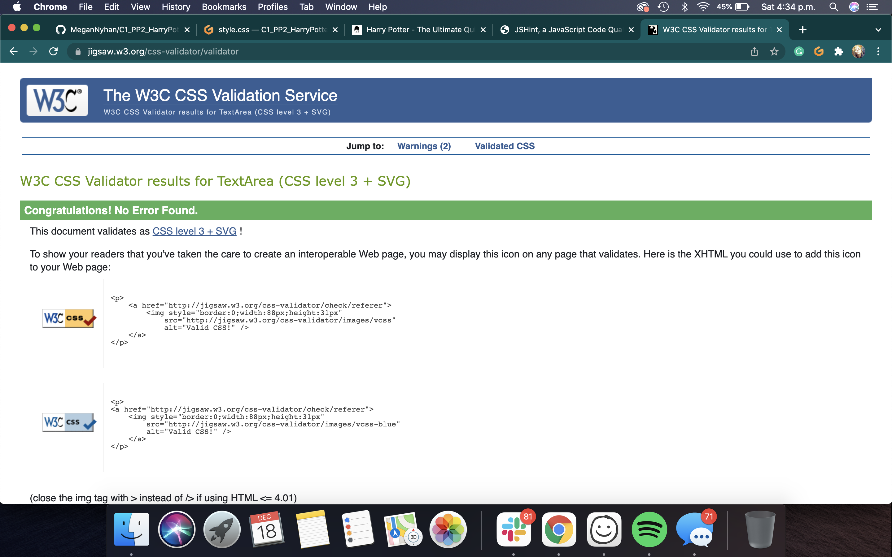
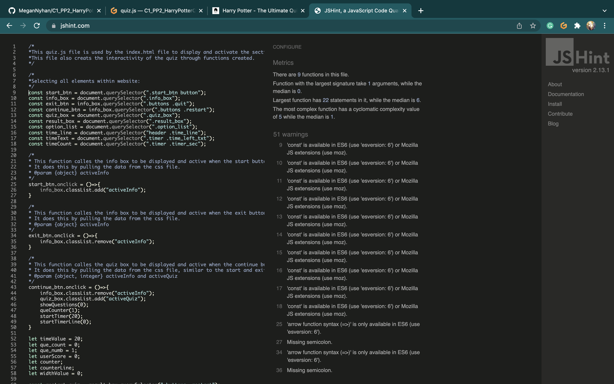
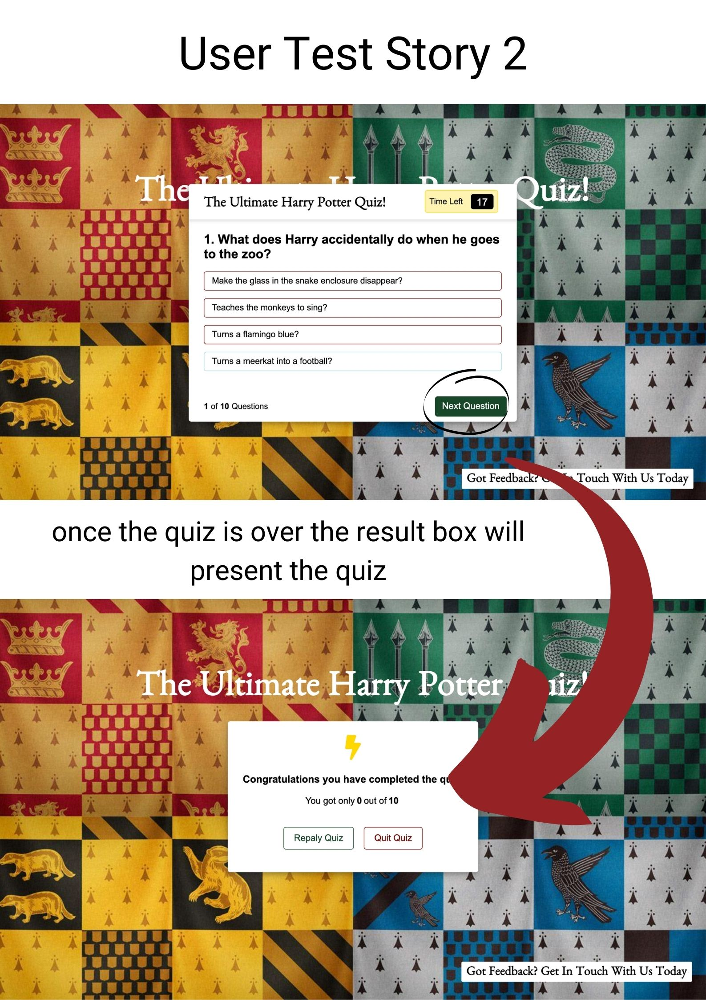

<a href="https://megannyhan.github.io/C1_PP2_HarryPotterQuiz/" alt="The Ulitmate Harry Potter Quiz Website" target="_blank" rel="noopener">Live Website</a>

 # PROJECT 2: THE ULTIMATE HARRY POTTER QUIZ

The Ultimate Harry potter Quiz, is a quiz that main purpose is to test members of the Harry Potter fandom's knowledge of the vast Harry Potter universe. The main purpose of this site is to offer the fandom of any age and technical background a chance to experience a fully interactive quiz, that offers the user feedback of how they are doing in the quiz/ how far through the quiz they are. *The quiz also utilizes email JS to send the users an automated email with the users result from the quiz*.

## Table of Content

1. [Project Goals](#project-goals)
    1. [User Goals](#user-goals)
    2. [Site Owner's Goals](#site-owners-goals)
2. [User Experience](#user-experience)
    1. [Target Audience](#target-audience)
    2. [User Requirements](#user-requirements)
    3. [User Stories](#user-stories)
3. [Design](#design)
    1. [Colour](#colour)
    2. [Fonts](#fonts)
    3. [Structure](#structure)
    4. [Wireframes](#wireframes)
4. [Technology](#technology)
    1. [Develpoment Languages Used](#develpoment-languages-used)
    2. [Frameworks and Tools used](#frameworks-and-tools-used)
5. [Features](#features)
6. [Testing](#testing)
    1. [HTML Validation](#HTML-validation)
    2. [CSS Validation](#CSS-validation)
    3. [JS Validation](#js-validation)
    4. [Accessibility Test](#accessibility-test)
    5. [Performance](#performance)
    6. [Device testing](#device-testing)
    7. [Browser Compatibility](#browser-compatibility)
    8. [Testing user stories](#testing-user-stories)
9. [Bugs](#Bugs)
10. [Deployment](#deployment)
11. [Credits](#credits)
12. [Acknowledgements](#acknowledgements)

## Project Goals 
### User Goals

<ul>
    <li>Allowing memebers of the Harry Potter fandom to quiz their knowledge of the Harry Potter universe.
    </li>
    <li>Be able to track how far in the quiz the users is, <strong>how many questions are answered and have yet to be answered</strong> which will aid the result they get at the end.</li>
    <li>Be able to enter their email <strong>to recieve their results</strong> directly into their mailboxes.</li>
    </ul>

### Site Owner's Goals
   <ul>
   <li> Increase traffic to the website.</li>
    <li>Allow the user to get feedback on each question that is answered, which will hopefully increase the users user experience of the site.</li>
    <li> Have a simply designed website that is accessibile to all users with any tech experience.</li>
    <li> Offer a direct point of contact to new or current users from the website.</li>
</ul>

### User Experience:

### Target Audience 

 The target audience for this site is quite broad. The fandom itself covers a wide range of ages, cultures and ethnicity. The english is easy and should be understandable to people regardless of theit levels of english. The simple design aids users of begginers knowledge of computers and is straight-forward to navigate through. 

### User Requirements

As I have mentioned, we have a very large/ varied target audience, and because of this the site has to be simple in design and very accessible. They way I have tackled this are as follows:

<ul>
    <li>Simple navigation that is non-ambiguous</li>
    <li>Have skimmable text for answers and questions which are easy to understand.</li>
    <li>Simple presentation of content on the page that make logical sense. </li>
    <li>A functional responsive wesite that allow the user to do the quiz, regardless of screen size. </li>
    <li>A straightforward and professional form that allows users to easily contact the business, and recieve their feedback.</li>
</ul>

### User Stories

### First time and Recurring Stories 
<ol>
    <li>As a user, I want to a quiz that is responsive to all screen types.</li>
    <li>As a user, I want to be able to test my knowledge of the harry potter universe and know how I scored at the end of the quiz.</li>
    <li>As a user I want to know exactly what my score was in the quiz without confusion.</li>
    <li>As a user who not tech savy, I want the quiz to be easy to navigate through and still be able to have as good of an experience as someone who knows how to navigate online better than me.</li>
        <li>As a user who doesn't understand websites, I want to easily know what answer I got wrong and right, and how many questions I still have to answer
    </li>
    <li>As a user who is new to the Harry Potter universe, I want to know what the correct answer is before even when I have answered the questions wrong.</li>

### Site's Owner Stories

   <li>As the owner of the site, I want my potential customers to have a place where they can enjoy playing a challenging quiz to entertain online users. </li>
    <li>As the owner, I want the website to be fully interactive and responsive to any screen sizes our users have.</li>
    <li>As the owner, I want a website that is accessible to anyone.</li>
    <li>As the owner, I want a site that will follow the branding that has been established by the franchise.</li>
    <li> As the owner, I want a site that will have the potential to be built upon in the future.</li>
    <li> As the owner, I want the customers to easily give feedback through email.</li>
</ol>

## Design:

### Design Choices

 The Harry Potter multiverse (both books and mives) itself is a multiverse with a wide target audience, and with this in mind I wanted to create a site that was accessible to everyone regardless of their technical ability, level of english, and ability to operate a computer. I wanted all designs to be simplistic, the navigation to be logical and seamless and for the accessibility to be a primary concern. 

### Colour

  
The color scheme that I have used throughout the website is taken directly from the brand guidelines that were available online. I used the following site to get the color scheme: https://www.qualitylogoproducts.com/blog/harry-potter-color-schemes/ . The colors here are used throughout the site on eachpage and interaction. 

Colours: Gryffindor

  

  

Colours: Slytherin

  

   

Colours: Ravenclaw

  

  

Colours: Hufflepuff

  

 ### Fonts
  
Fonts used on the website were Arial and Benne - A sans serif with a Harry Potter vibe. Benne was used for headings and arial was used in pteh answers.

 ### Structure

The structure of this website was designed to be easily navagated through and easy to learn. I made sure that each page followed a similar structure but didn't comprimise the content that each page held. The following sections are within the structure of the site:

<ul>
<li> A home Page = Start button for the quiz and a contact button for users to access a contact form.</li>
<li> A Contact page = The contact page allows users to send an email to the site owner to give feedback on the site. </li>
<li> The quiz Section = The quiz section is where the questions and answers are. The user has 4 answer options to choose from and depending on the answer (if correct or incorrect) the user an icon with the correct answer will show. If your answer is wrong an x will appear beside it. Also here, the user is able to dictate what question their on by the question counter at the bottom of the section. There is a timer at the top of the section that will count down from 20 seconds, and if it runs out it will disable the quiz and show the correct answer.</li>
<li> The Results Page = Shows the user their score out of ten. It will also give the user the option of restarting the quiz or quiting it - taking them back to the start/home page.</li>
<li> Also in the quiz there is an info section that goes over some rules that the user has to follow when going through the quiz.</li>

### Wireframes

The wireframes included have evolved and changed since I originally drew them up over a week ago. This is due to the limitations of my skills thus far, and developed and changes I have made personally to the look of the site when building it.

 Home/Start Page

 Rules Section

 Questions Section 

Result Section

Contact Section

## Technology:

### Develpoment Languages Used

<ul>
<li> HTML5 </li>
<li> CSS </li>
<li> JavaScript</li>
<li> EmailJS </li>
</ul>

###  Frameworks and Tools used
<ul>
<li> Git, GitHUb, and GitPod </li>
<li> Balsamiq </li>
<li> Google Fonts </li>
<li> Font Awesome </li>
<li> Google Developer Tools (for responsive site)</li>
<li> EmailJS </li>
</ul>

## Features:

This site has two pages- four sections with a total of nine features.

### Home/Start  Page

#### Start Button

<ul>
    <li>The navigation bar is very limited to what the user can do, where you can go and what options there are to choose from. The nav bar is basically a start quiz button. There is also a "email your results" option where you can send yourself your results to your email. </li>
    <li> The navigation will also be responsive across all devices, which will also serve to the accessibilty of the site do a myriad of users.</li>
    <li> Navigation throught the quiz features a next question button. The user is not able to exit the quiz before they finish it. This is made clear to the users at the information/rules section that they have to read before entering the quiz. Here there is a continue with quiz or exit quiz option.</li>
    <LI> When the quiz is over the user is given the option of replaying the quiz or quiting it. Quiting it takes the user back to the start quiz screen, and replay takes the user to the first question of the quiz.</LI>
    </ul>
 
 User Stories covered : 1, 4

 
 Site Owner's Stories covered: 2, 3, 5,6 

        

Navigation

        

        
#### Information/ Rules section
<ul>
    <li>The Information/rules section offers the user 4 brief set of rules to help quide them through the quiz.</li>
    <li> These rules include:   1. You will have only 20 seconds to answer each question.
                                2. Once you select your answer you will have to move onto the next question.
                                3. You will be unable to select another answer once the time runs out.
                                4. Your overall score is dictated by the amount of correct answers you have scored..</li>
    </ul>
    
 User Stories covered : 4

    
Site Owner's Stories covered: 2, 3

        

Information/ Rules Section

        

#### Correct Answer, and Incorrect Answer
<ul>
     <li>
     As a feature of the Questions and Answers section of the quiz, when an answer is answered teh User will get direct feedback from the quiz to let them know if they have answered correctly or not. If the answer is wrong the user will be told and the correct answer will be revealed with a tick beside it in green.</li>
     <li> The main purpose of this is to offer the User directed feedback from the quiz. 
     </li>
     </ul>
     
 User Stories covered : 3, 4, 5, 6

     
Site Owner's Stories covered: 6 

        

Questions and Answers

        

#### Timer in Q&A Section
<ul>
     <li> The timer gives the user a time limit to answer the quiz. It counts down from 20 to give the user 20 seconds to answer.</li>
     <li> The timer, when it runs out, will stop the user from answering the quiz and will show them the correct answer that they should of chosen.</li>
     </ul>
     
 User Stories covered : 4,

     
 Site Owner's Stories covered: 1, 3, 6

        

Footer

        

### Question Counter
<ul>
    <li> The question counter at the bottom of the page offers the user an easy way of keeping track on the amount of questions they have answered and how many they have left to answer. It works similar to a progress bar.</li>
    </ul>
    
 User Stories covered : 3, 5

    
Site Owner's Stories covered: 1, 3, 6
 
        

Question Counter

        

### Result Page

<ul>
    <li>The Result Page is where the users scores are displayed when they have completed the quiz.</li>
    <li> The main purpose of this section is to display the score the user earned and also to give them the option of restarting the quiz or quiting it altogether and returning to the start screen.</li>
    </ul>
    
 User Stories covered : 3, 4

    
Site Owner's Stories covered: 2, 4

        

Result Page

        

### Contact Page

#### Contact Form
<ul>
    <li>The contact page offers the user a chance to give the company realtime feedback on the quiz. </li>
    <li> The contact form is linked to emailJS and will submit the email to the company once the submit button is pressed.</li>
    </ul>
    
 User Stories covered :2, 3, 5, 6

    
Site Owner's Stories covered: 2, 4, 6
 
        

Contact form

        

### Working with EmailJS

 EmailJS offered me to create an interactive contact form that allowed the user to directly contact the company to give feedback about the quiz.

<ul>
<li>Within the send email function I directly linked the function to send the email template I created on the Email JS website to send the email with what the user has typed into the forms input fields. </li>
</ul>

### Page 404

 I have also made a page 404 page so if the user manages to search a page that doesn't exist they are prompted to go back to the quiz. The button to return to the quiz is at the top left beside the return button.

page 404

## Testing:
### HTML Validation

 To Validate my HTML I used the W3C Markup Validation Service. All HTML passed its Validation with no errors but a few warnings as shown below in the pictures.

html

 ### CSS Validation

 To Validate my CSS, I used the W3C Jigsaw CSS Validation Service. All CSS passed its Validation.

CSS

### JS Validation

 To Validate my Java Script, I used the JSHint JS Validation Service. All Java Script passed its Validation with just a few warnings.

email.js

script.js

questions.js

### Accessibility Test

 To Validate my accessibility, I used the WAVE WebAIM web accessibility evaluation tool. I passed with no errors. My site was awarded the following: https://wave.webaim.org/report#/https://megannyhan.github.io/C1_PP2_HarryPotterQuiz/ 

Quiz

## Performance

 To determine my sites performance, I used the Ligthouse web accessibility develepment tool. My site was awarded the following: 

Website Test

Mobile Test
 

## Device Testing

The site was tested on the following decives using the responsive tool in Google Chromes Developer tools:

<ol>
<li>MacBook Pro</li>
<li>iPhone xr/11/12</li>
<li>iPad (Regular size)</li>
</ol>

## Browser Compatibility

 The site was also tested on the following browsers

<ol>
<li>Google Chrome</li>
<li>Safari</li>
<li>Firefox</li>
</ol>

### Testing User Stories

    1."As a user, I want to a quiz that is responsive to all screen types."
| **Feature** | **Action** | **Expected Result** | **Actual Result** |
|-------------|------------|---------------------|-------------------|
| Responsive site design| Use the website on serveral different screens | Website works fine ans effectively on all screens |    Works as expected |

User Testing 1

    2."As a user, I want to be able to test my knowledge of the harry potter universe and know how I scored at the end of the quiz."
| **Feature** | **Action** | **Expected Result** | **Actual Result** |
|-------------|------------|---------------------|-------------------|
| Results section at the end of the quiz | Answer all the questions within the quiz to get an accurate result at the end of the quiz | The user is presented the results they scored from answering the questions in the quiz | Works as expected |
| Questions- Answer the questions in the, once finished press continue | Once the quiz is over | View the results in the result section | Works as expected |

User Testing 2

    3."As a user I want to know exactly what my score was in the quiz without confusion."
| **Feature** | **Action** | **Expected Result** | **Actual Result** |
|-------------|------------|---------------------|-------------------|
| Results section at the end of the quiz | Answer all the questions within the quiz to get an accurate result at the end of the quiz | The user is presented the results they scored from answering the questions in the quiz | Works as expected |
| Questions- Answer the questions in the, once finished press continue | Once the quiz is over | View the results in the result section | Works as expected |

User Testing 3

    4."As a user who not tech savy, I want the quiz to be easy to navigate through and still be able to have as good of an experience as someone who knows how to navigate online better than me."
| **Feature** | **Action** | **Expected Result** | **Actual Result** |
|-------------|------------|---------------------|-------------------|
|Navigation| Navigate through the quiz easily and logically | Finds the quiz easy to navigate | Works as expected |
|Navigation comprises as the buttons that are available throughout the quiz | All pages allows the user to continue on through the quiz. Once in the quiz you have to finish the quiz | Navigate the quiz easily | Works as expected |

User Testing 4

    5."As a user who doesn't understand websites, I want to easily know what answer I got wrong and right, and how many questions I still have to answer."
| **Feature** | **Action** | **Expected Result** | **Actual Result** |
|-------------|------------|---------------------|-------------------|
| Correct or Incorrect Answer and question counter | Once the question is answered and the user selects their answer, an icon will come up with a tick (if right) or cross (if wrong). Once the next question button is pressed the question counter changes | User can easily read if they answered correctly or incorrectly and how many questions are left to answer |Works as expected |
|Answer validaton for the user and question counter | Available within the question section | Views if they got the answer wrong or right, and how many question they have left to answer | Works as expected |

User Testing 5

    6."As a user who is new to the Harry Potter universe, I want to know what the correct answer is before even when I have answered the questions wrong."
| **Feature** | **Action** | **Expected Result** | **Actual Result** |
|-------------|------------|---------------------|-------------------|
|Correct or Incorrect Answer |  Once the question is answered and the user selects their answer, an icon will come up with a tick (if right) or cross (if wrong). | User can easily read if they answered correctly or incorrectly | Works as expected |
|Answer validaton for the user | Available within the question section|| Views if they got the answer wrong or right | Works as expected |

User Testing 6

### Testing Site Owner's Stories

    1."As the owner of the site, I want my potential customers to have a place where they can enjoy playing a challenging quiz to entertain online users."
| **Feature** | **Action** | **Expected Result** | **Actual Result** |
|-------------|------------|---------------------|-------------------|
| Interactive quiz | The site's user can enjoy a interactive quiz, answering question s with direct feedback | The user will enjoy the quiz | Works as expected |

User Testing 7

    2."As the owner, I want the website to be fully interactive and responsive to any screen sizes our users have."
| **Feature** | **Action** | **Expected Result** | **Actual Result** |
|-------------|------------|---------------------|-------------------|
| Responsive site design| Use the website on serveral different screens | Website works fine ans effectively on all screens |    Works as expected |

User Testing 1

    3."As the owner, I want a website that is accessible to anyone."
| **Feature** | **Action** | **Expected Result** | **Actual Result** |
|-------------|------------|---------------------|-------------------|
|Navigation| Navigate through the quiz easily and logically | Finds the quiz easy to navigate | Works as expected |
|Navigation comprises as the buttons that are available throughout the quiz | All pages allows the user to continue on through the quiz. Once in the quiz you have to finish the quiz | Navigate the quiz easily | Works as expected |

User Testing 4
 
User can enjoy a logical, and simple, good experience from the onset of the quiz 

    4."As the owner, I want a site that will follow the branding that has been established by the franchise."
| **Feature** | **Action** | **Expected Result** | **Actual Result** |
|-------------|------------|---------------------|-------------------|
|The colours used throughout the site is of the brand guidelines of the franchise| Recognisable colours of the website ties the quiz to the franchise| Knows from the first look of the quiz it's harry potter related| Works as expected |

User Testing 10
 
 Brand guidelines 

    5."As the owner, I want a site that will have the potential to be built upon in the future."
| **Feature** | **Action** | **Expected Result** | **Actual Result** |
|-------------|------------|---------------------|-------------------|
| The start page offers the owner space to add more options| Navigation bar is wide and I as a developer intend to add a blog section in the future among other pages | To have more options added to the start page without comprimising the readability| Works in progress |

User Testing 11

 The Navigation bar is simple and can easily be extended on any device..

    6."As the owner, I want the customers to easily give feedback through email."
| **Feature** | **Action** | **Expected Result** | **Actual Result** |
|-------------|------------|---------------------|-------------------|
|Contat Page with a contact form | Navigate to the Contact Page, using the link and find a contact form | Find the form easily and contact the business easily| Works as Expected|
|Contact page with contact form| On any page scroll down to the contact page link| Finds the contact form | Works as expected |

User Testing 12

## Bugs:

| **Bug** | **Fix** |
| ----------- | ----------- |
| When the user selects their answer, the icons come up. But when you select the other options on the same screen icons come up for the other options too| Put a non-repeat setting within the function optionSelected|

Bugs

## Deployment:

In order to deploy my site I took the following steps using GitHub pages:

<ol>
<li>In the GitHub repository, select the "Settings" tab at the top of the page.</li>
<li> Then on the left hand-side in the menu, select "Pages".</li>
<li> The where it says source, used the dropdown menu to select "Main".</li>
<li> After a few moments, refresh the website and you should have a pop-up come up to tell you that "Your site has been published" with your link coming after.</li>
</ol>

 My link is: https://megannyhan.github.io/C1_PP2_HarryPotterQuiz/ 

 Forking the repository is done by the following steps:

<ol>
<li>Within the GitHub repository, click "Fork" (a button) at the upper right hand corner.</li></ol>

 Cloning the repository is done by the following steps:

<ol>
<li>Within the GitHub repository, locate "Code" (a button) found at the top of the page.</li>
<li> Once selected, select which you prefere out of the following choise: HTTPS, SSH or GitHub CLI and press the copy URL to your clipboard.</li>
<li> Then open Git Bash.</li>
<li> Change the current directory to your desired location for the cloned directory.</li>
<li>Finally, type "git clone" and paste your URL.</li>
<li>Once you press enter your local clone is created.</li></ol>

## Credits:

 Images not li nked and referenced below were designed and taken by the author.

### Site Images:
<ul>
<li>https://wallpapercave.com/hogwarts-houses-wallpapersPhoto by Wallpapper Cave</li>
</ul>

## Source Code Used in Site

 Due to limitations in my knowledge I googled certain code that I wanted to use for the site, see code listed below:

<ul>
<li> Code to help with the contact form was taken from bootstrap: https://getbootstrap.com/docs/5.1/forms/form-control/ 
</li>
<li> I also used a youtube video to help further my understanding of JavaScript and aid me in the making of my quiz: https://www.youtube.com/watch?v=WUBhpSRS_fk&t=1732s . It was not copied and pasted directly but it was used for help so I thought I would mention it. </li>
</ul>

## Acknowledgements:

 I would like to take this oppurtuinity to thank and acknowlege the following people:
<ul>
<li> I would like to thank Mo Shami - my mentor - for his feedback and guidence whilst creating the project.</li>
<li> I would like to thank those on the code institute slack channel for help with any issues I had.</li>
<li> I also want to say that I did intend on making a error 404 page but ran out of time.</li>
</ul>

